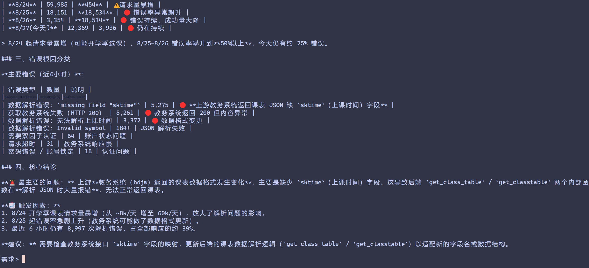
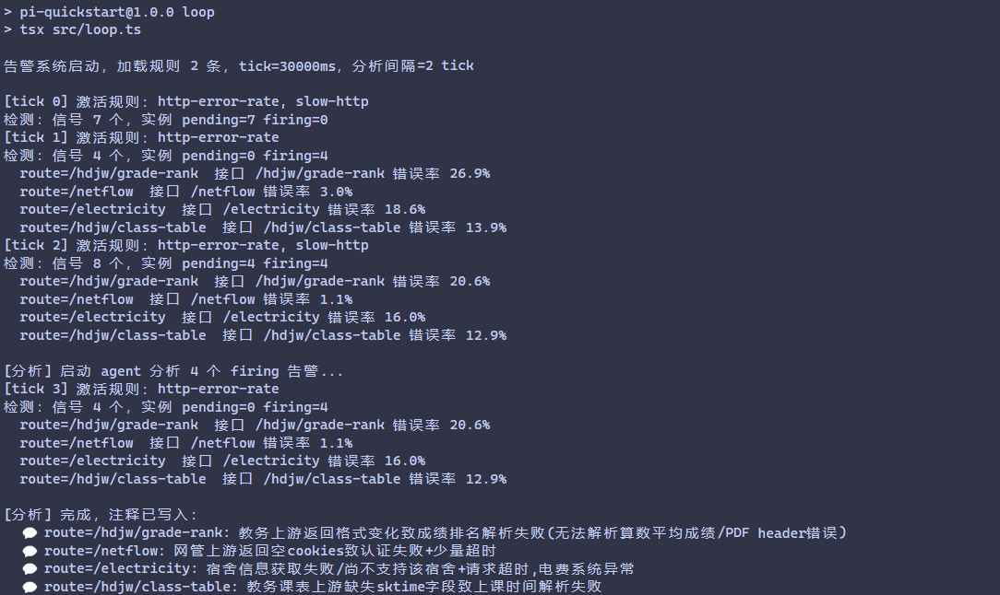

# qnxg agent

易千 agent，一个实验性质的 agent 自动化运维项目。可以通过封装好的工具查询 GreptimeDB ，并通过内置的 quickjs 灵活分析数据。agent 部分直接采用了 pi sdk。





## 运行

1. 配置环境

```
GREPTIME_USERNAME=user_name
GREPTIME_PASSWORD=your_password_here
GREPTIME_URL=https://your_website.com/v1/sql

DEEPSEEK_API_KEY=your_deepseek_api_key
```

默认模型为 deepseek 官方平台的 deepseek-v4-flash 模型，可以去 backend/pi-config 文件夹内自行配置，该文件夹内是 pi agent 配置文件，[参考文档](https://pi.dev/docs/latest/models)。

2. 运行

安装依赖
```
pnpm install
```

模式一：以 agent 模式运行，交互式分析 greptime 数据库
```
pnpm run agent
```

模式二：以告警模式运行，循环检测并生成告警信号，调用 agent 分析原因。
```
pnpm run loop
```

模式三：Web UI（agent 对话界面，shadcn/ui）

```
# 开发模式（前后端热更新，前端 http://localhost:5173）
pnpm web:dev

# 生产模式（自动构建前端后由后端统一 serve，http://localhost:3210）
pnpm web
```

3. 可选配置

backend/src/alert/rules 目录下为告警规则集，可以将自定义告警规则加入其中。

## TODO

- [x] webui（agent 对话页已完成；告警面板待做）
- [ ] 接入 qq 机器人
- [ ] 补充更多提示词，它现在连有哪些接口都不知道
- [ ] 开放读取本地代码的工具权限（现在把所有内置工具全都禁用了），可以直接在后端与爬虫代码里追踪问题
- [ ] 自动提 issue / pr
- [ ] 自动唤醒，比如代码检测到异常状态后自动唤醒 agent 排查问题
